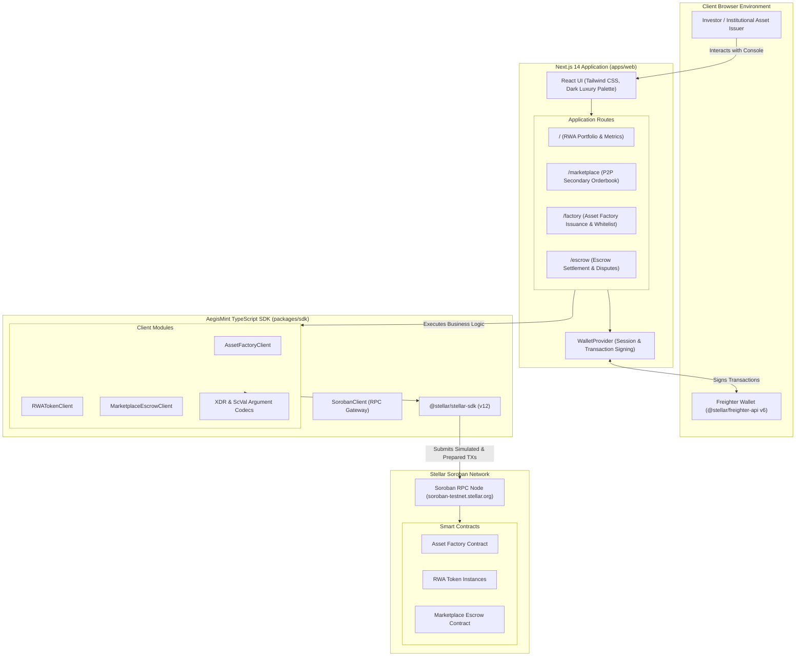

<div align="center">

# AegisMint Labs
### Institutional RWA Tokenization & Peer-to-Peer Marketplace Protocol on Stellar Soroban

[](https://stellar.org/soroban)
[](https://nextjs.org/)
[](https://www.typescriptlang.org/)
[](LICENSE)


</div>

---

## Overview

AegisMint Labs is a decentralized real-world asset (RWA) compliance launchpad and marketplace built natively on the Stellar network using Soroban smart contracts. It bridges institutional asset issuers, compliance officers, and global traders by enforcing strict on-chain transfer whitelists, deterministic asset factories, and non-custodial peer-to-peer escrow settlement.

This repository (`aegismint-app`) hosts the official **TypeScript SDK** and the **Next.js 14 frontend application**.

---

## System Architecture

```text
       [ Asset Issuer ] 
              │
              ▼
   ┌─────────────────────┐
   │    AssetFactory     │ ──(Deploys & Initialises)──► [ RwaToken Contracts ]
   └─────────────────────┘                                       │
              │ (Whitelisting & Compliance)                      │ (Fractional Balances)
              ▼                                                  ▼
   ┌────────────────────────────────────────────────────────────────────────┐
   │                         MarketplaceEscrow                              │
   │            (Atomic P2P Settlement against Stablecoins / USDC)          │
   └────────────────────────────────────────────────────────────────────────┘
```

### Monorepo Architecture Flow



---

## Monorepo Workspaces

1. **`apps/web` (Next.js 14 App Router & API Routes)**:
   - High-performance institutional financial terminal interface styled with custom dark glassmorphism and Tailwind CSS tokens.
   - Built-in Freighter wallet connection detection, network inspection, and signature passing.
   - RWA Portfolio Dashboard with live balances, yields, and transfer flows.
   - P2P Orderbook with visual depth bars and atomic trade fulfillment.
   - Asset Factory Console for deploying regulated assets and configuring jurisdiction restrictions.
   - Escrow Settlement Console with Delivery vs. Payment (DvP) guarantee and dispute resolution.
   - Server-side API routes (`/api/tx/build`, `/api/tx/submit`, `/api/escrow/fulfill`, `/api/escrow/orders`) generating unsigned transaction XDR for safe client-side Freighter signing.

2. **`packages/sdk` (`@aegismint/sdk`)**:
   - Production-grade TypeScript SDK for interacting with Stellar Soroban smart contracts.
   - Strongly typed client wrappers for `RWATokenClient`, `AssetFactoryClient`, and `MarketplaceEscrowClient`.
   - Comprehensive XDR argument encoders and decoders in `encoders.ts` (`Address`, `i128`, `u128`, `bool`, `u32`, `u64`, `symbol`, `string`, `bytes`, `vec`, `map`, and contract argument builders).
   - Transaction simulation, resource footprint auto-preparation, and submission polling pipeline.

3. **`backend` (`@aegismint/backend`)**:
   - Server-side transaction construction layer with Soroban RPC helpers.
   - Prepares unsigned transaction XDR, calculates Soroban resource footprints, and broadcasts signed transactions.
   - Provides standalone REST endpoints mirroring the Next.js API routes for headless institutional integrations.


---

## Quick-Start Guide

### Prerequisites

- **Node.js**: `v20.x` or later (tested on v20 and v26)
- **pnpm**: `v9.x`
- **Freighter Browser Extension**: Installed from [freighter.app](https://www.freighter.app/) (or use built-in Demo Account mode)

### 1. Installation

```bash
# Clone the repository
git clone https://github.com/AegisMint-Labs/aegismint-app.git
cd aegismint-app

# Install all workspace dependencies
pnpm install
```

### 2. Environment Configuration

```bash
# Copy example environment configuration
cp apps/web/.env.example apps/web/.env.local
```

Default configuration in `apps/web/.env.local`:

```env
# Stellar Network Settings
NEXT_PUBLIC_STELLAR_NETWORK=TESTNET
NEXT_PUBLIC_SOROBAN_RPC_URL=https://soroban-testnet.stellar.org:443
NEXT_PUBLIC_HORIZON_URL=https://horizon-testnet.stellar.org
NEXT_PUBLIC_FRIENDBOT_URL=https://friendbot.stellar.org

# Verified Deployed Contract Addresses on Testnet
NEXT_PUBLIC_FACTORY_CONTRACT_ID=CB7VZCJWUBZZFAFYZYSPATZEOFUZKP2PJ2DNRA6KVC5HYN3FFY5AJ5NP
NEXT_PUBLIC_ESCROW_CONTRACT_ID=CAEZQ7WGOHF2EPJILURGYTL22JS6AXWCTN7UW6ZPBOQRJ4J24CRUFIIG
NEXT_PUBLIC_USTB_CONTRACT_ID=CDMXSOPMD6Q4FI6ZQTPT3DRR363ZQXKT5Z5GZYIPI7D3LPTP5AQMD3UJ
NEXT_PUBLIC_AUSD_CONTRACT_ID=CCGITDPYWMXF7APRVJI2ABTL6UJOCJWMWHSZU6WMN4ONGZJJJHOQHJX3
NEXT_PUBLIC_CRE_CONTRACT_ID=CANWJ5TDZBSH7QSHNJ7WSRINBKZEU3Z7DRUFAKN6KOQVQRHXJG3THQU7
```

### 3. Build Monorepo

```bash
# Compile SDK and build Next.js production bundle
pnpm build
```

### 4. Run Development Server

```bash
# Launch Next.js local development server
pnpm dev
```

Open [http://localhost:3000](http://localhost:3000) to view the application console.

### 5. Running SDK Tests

```bash
# Run SDK unit tests verifying XDR encoders and decoders
node --test packages/sdk/dist/encoders.test.js
```

---

## 📁 Repository Structure

```
aegismint-app/
├── .github/
│   └── workflows/
│       └── ci.yml                   # GitHub Actions CI (build, test, lint)
├── apps/
│   └── web/                         # Next.js 14 frontend application & API routes
│       ├── src/
│       │   ├── app/                 # App Router pages & API routes
│       │   │   ├── api/             # Server-side transaction & escrow routes
│       │   │   │   ├── tx/build/    # Constructs unsigned transaction XDR
│       │   │   │   ├── tx/submit/   # Broadcasts signed XDR to Soroban RPC
│       │   │   │   └── escrow/      # Dedicated order fulfillment & listing APIs
│       │   │   ├── escrow/          # Escrow Settlement & DvP Dispute page
│       │   │   ├── factory/         # Asset Factory issuance console
│       │   │   └── marketplace/     # P2P Secondary Orderbook
│       │   ├── components/          # UI components (WalletConnect, Orderbook, etc.)
│       │   ├── context/             # WalletContext with Freighter v6 integration
│       │   └── server/              # ServerSorobanTxService helpers
│       ├── tailwind.config.ts       # Tailwind CSS luxury dark theme
│       ├── next.config.mjs          # Next.js configuration
│       └── package.json             # Web application manifest
├── backend/                         # Standalone Node/Express transaction service
│   ├── src/
│   │   ├── tx-builder.ts            # Soroban RPC transaction preparation
│   │   └── index.ts                 # REST API endpoints & health check
│   ├── tsconfig.json                # TypeScript configuration
│   └── package.json                 # Backend package manifest
├── packages/
│   └── sdk/                         # TypeScript SDK (@aegismint/sdk)
│       ├── src/
│       │   ├── contracts/           # Smart contract client wrappers
│       │   │   ├── rwa_token.ts     # SEP-41 + Compliance client
│       │   │   ├── asset_factory.ts # Factory deployment & registry client
│       │   │   └── marketplace_escrow.ts # P2P Escrow orderbook client
│       │   ├── client.ts            # Soroban RPC client & transaction runner
│       │   ├── constants.ts         # Networks & contract constants
│       │   ├── encoders.ts          # XDR ScVal encoders and contract call builders
│       │   ├── encoders.test.ts     # Unit tests for encoders
│       │   └── types.ts             # Comprehensive TypeScript types
│       ├── tsconfig.json            # TypeScript configuration
│       └── package.json             # SDK package manifest
├── pnpm-workspace.yaml              # Monorepo workspace definition
├── package.json                     # Monorepo root scripts
├── CONTRIBUTING.md                  # Contributor guidelines
├── SECURITY.md                      # Security policy & vulnerability reporting
├── LICENSE                          # MIT License
└── README.md                        # Documentation
```

---

## 👥 Maintainers & Contact

**AegisMint Labs Core Engineering Team**
- **Repository**: [AegisMint-Labs/aegismint-app](https://github.com/AegisMint-Labs/aegismint-app)
- **Organization**: [AegisMint Labs](https://github.com/AegisMint-Labs)
- **Technical Inquiries**: dev@aegismint.io
- **Security Inquiries**: security@aegismint.io
- **Grants & Evaluation**: grants@aegismint.io

---

## 📄 License

This repository is licensed under the [MIT License](LICENSE).
