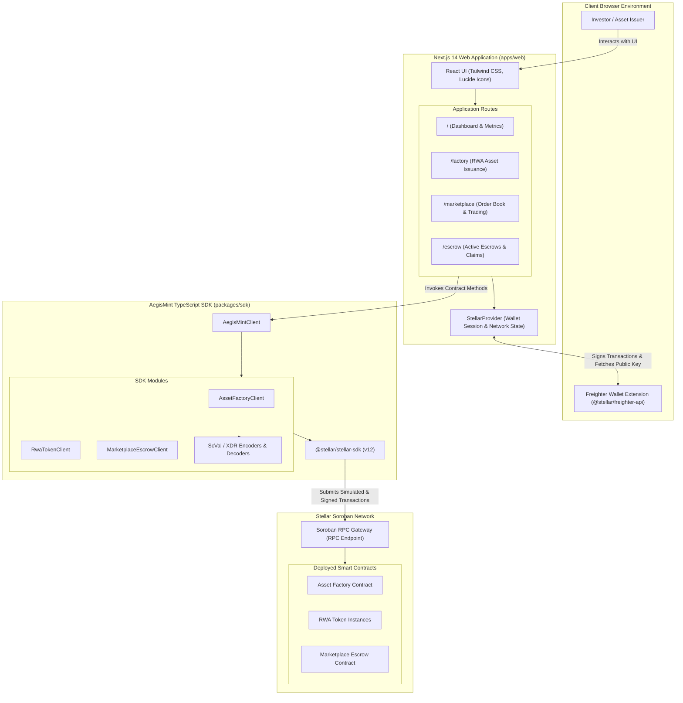

# AegisMint Web Application & TypeScript SDK

A production-ready decentralized application (dApp) and TypeScript SDK for compliant tokenization and secondary trading of Real World Assets (RWAs) on the Stellar blockchain. Submitted for evaluation to **Drips Waves** and **GrantFox**.

---

## 🏗️ Architecture

The AegisMint application monorepo decouples user interface workflows, wallet session handling, and contract RPC orchestration into modular layers.

### Monorepo Architecture Diagram



### Monorepo Workspaces

1. **`apps/web` (Next.js 14 App Router)**:
   - Modern, responsive Web3 interface styled with Tailwind CSS.
   - Built-in Freighter wallet integration for non-custodial key management and transaction signing.
   - Dedicated management screens for asset factory issuance, investor whitelisting, order book trading, and escrow lifecycle tracking.

2. **`packages/sdk` (`@aegismint/sdk`)**:
   - Zero-boilerplate TypeScript client library for Stellar Soroban contracts.
   - High-level wrappers around `AssetFactoryContract`, `RwaTokenContract`, and `MarketplaceEscrowContract`.
   - Comprehensive XDR and `ScVal` encoders (`scValToBigInt`, `addressToScVal`, `stringToScVal`, `bytesToScVal`).
   - Transaction simulation and submission pipeline with automatic fee and resource estimate handling.

---

## 🚀 Quick-Start Guide

### Prerequisites

- **Node.js**: `v20.x` or later (LTS recommended)
- **pnpm**: `v9.x`
- **Freighter Browser Extension**: Installed and switched to Stellar Testnet

### 1. Installation

```bash
# Clone the repository
git clone https://github.com/AegisMint-Labs/aegismint-app.git
cd aegismint-app

# Install all workspace dependencies
pnpm install
```

### 2. Environment Configuration

Create an environment configuration file in `apps/web/`:

```bash
# Create local environment configuration
cp apps/web/.env.example apps/web/.env.local
```

Configured default variables:

```env
# Stellar Network Settings
NEXT_PUBLIC_STELLAR_NETWORK=TESTNET
NEXT_PUBLIC_SOROBAN_RPC_URL=https://soroban-testnet.stellar.org:443
NEXT_PUBLIC_HORIZON_URL=https://horizon-testnet.stellar.org

# Deployed Contract Addresses on Testnet
NEXT_PUBLIC_FACTORY_CONTRACT_ID=CAAAAAAAAAAAAAAAAAAAAAAAAAAAAAAAAAAAAAAAAAAAAAAAAAAAD2KM
NEXT_PUBLIC_ESCROW_CONTRACT_ID=CBAAAAAAAAAAAAAAAAAAAAAAAAAAAAAAAAAAAAAAAAAAAAAAAAAAAFOI
```

### 3. Build Monorepo

```bash
# Build the TypeScript SDK and Next.js frontend without type errors
pnpm build
```

### 4. Run Development Server

```bash
# Run both the SDK build watcher and Next.js local server
pnpm dev
```

Open [http://localhost:3000](http://localhost:3000) in your browser to interact with the AegisMint application.

---

## 📁 Repository Structure

```
aegismint-app/
├── apps/
│   └── web/                     # Next.js 14 frontend application
│       ├── src/
│       │   ├── app/             # App Router pages (/factory, /marketplace, /escrow)
│       │   ├── components/      # UI components & form managers
│       │   └── context/         # Stellar & Freighter wallet context
│       ├── tailwind.config.ts   # Tailwind CSS configuration
│       ├── next.config.mjs      # Next.js configuration
│       └── package.json         # Web workspace manifest
├── packages/
│   └── sdk/                     # Modular TypeScript SDK (@aegismint/sdk)
│       ├── src/
│       │   ├── contracts/       # Contract client implementations
│       │   ├── client.ts        # Primary AegisMintClient interface
│       │   ├── encoders.ts      # ScVal and XDR conversions
│       │   └── types.ts         # TypeScript interfaces & types
│       ├── tsconfig.json        # TypeScript configuration
│       └── package.json         # SDK package manifest
├── pnpm-workspace.yaml          # Monorepo workspace definition
├── package.json                 # Monorepo root scripts
├── CONTRIBUTING.md              # Contributor guidelines
├── SECURITY.md                  # Security policy & vulnerability reporting
└── README.md                    # Project documentation
```

---

## 👥 Maintainers & Contact

**AegisMint Labs Core Engineering Team**
- **Repository**: [AegisMint-Labs/aegismint-app](https://github.com/AegisMint-Labs/aegismint-app)
- **Organization**: [AegisMint Labs](https://github.com/AegisMint-Labs)
- **Technical Inquiries**: dev@aegismint.io
- **Security Inquiries**: security@aegismint.io
- **Grant Evaluation Inquiries**: grants@aegismint.io

---

## 📄 License

This repository is licensed under the [MIT License](LICENSE).
